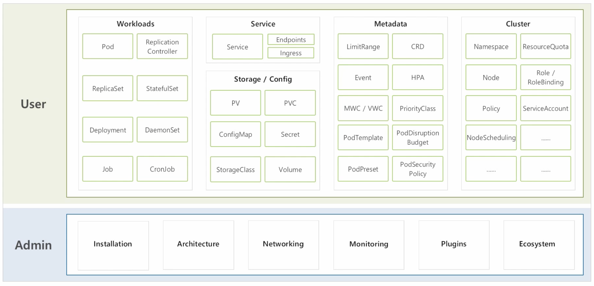

# 1. 학습하기 전에

### 쿠버네티스의 배경

- 큰 기업들은 대규모의 서비스를 운영하고 있기 때문에 자원을 최대한 효율적으로 써야 **비용적으로 유리**합니다.
  - 그래서 **가상화기술**에 대한 관심이 중요합니다!
- 최초의 **리눅스**의 등장으로 자원을 격리하는 기술 ( 프로세스가 독립적인 환경에서 돌아갈 수 있도록 지원 )이 등장했지만 사용법이 매우 어려워 대중적으로 사용할 수 없습니다.
- 그 다음 **VM** ( 가상화 기술 )이 등장하게 됨으로써 대중적으로 사용하게 되었습니다.
  - 자동화는 성공했지만 시스템 효율이 떨어지게 됩니다.
  - 큰 원인은 VM가상화를 하기 위해서 무거운 OS를 띄어야 하기 때문에 많은 문제가 발생했습니다.
- 그 이후 **Container**라는 개념으로 가상화 기술을 개발 => **Docker**
  - 서비스간에 자원격리를 하는데 OS를 별도로 안띄워도 됩니다.
  - OS 가동시간이 없기 때문에 자동하시에 엄청 빠르고, 자원 효율도 매우 높았습니다.
  - 하지만 엄청 많은 서비스들을 운영할 때 그걸 일일이 배포하고 운영하는 역할을 해주지 않았습니다.
    - 즉 직접 하나의 서비스를 컨테이너로 가상화시켜서 배포를 하였습니다.
  - 그래서 **컨테이너 오케스트레이터**라는 개념이 도입되면서 여러 컨테이너들을 관리해주는 솔루션들을 회사들 내부에서 개발하고 사용하기 시작했습니다.
    - 그래서 오케스트레이터를 사용하기 위해 수많은 서비스들 중에서 선택해서 사용해야 했습니다.
  - 그 중에서 Google의 **쿠버네티스**가 등장하면서 기하급수적으로 많이 사용하게 되었습니다.
    - Google이 주도했지만 수많은 유명한 업체들이 함께 참여해서 각 자의 시스템 운영의 노하우들을 다 담게 되었습니다.
- 쿠버네티스는 오픈소스 이기 때문에 직접 설치해서 자기의 운영환경에 맞게 최적화를 진행할 수 있습니다.

### 쿠버네티스의 다양한 기능

- 쿠버네티스 클러스터를 운영하는 **운영자**와 쿠버네티스 기능들을 활용해서 자신의 서비스를 배포하는 **사용자**로 나눌 수 있습니다.

- 또한 그림처럼 수많은 기능들이 존재합니다!

  

