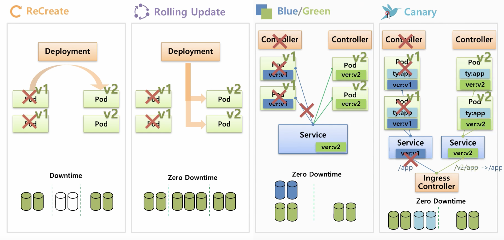
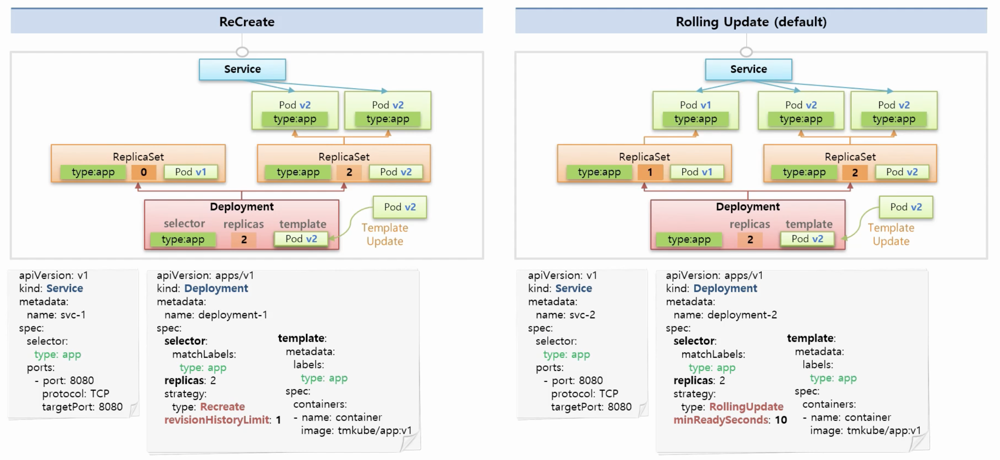

# 10. Controller-Deployment

- 현재 한 서비스가 운영중일 때 서비스가 운영중일 때 이 서비스를 업데이트 해야되서 **재배포**를 해야할 때 도움을 주는 컨트롤러 입니다.


### 일반적인 업그레이드 방식



- ReCreeate
  - Deployment를 생성하면 v1의 Pod들이 생성됩니다.
  - 업그레이드 진행시 먼저 Pod들을 삭제합니다.
  - 서비스의 **Downtime**이 생기게 됩니다.
  - 그 다음 v2의 Pod들을 생성하게 됩니다
  - 단점 : 일시적인 정지가 가능한 서비스 일 경우 사용가능합니다.
- Rolling Update
  - Deployment는 v2의 Pod를 생성합니다.
    - 추가적인 자원이 요구됩니다.
  - v1의 Pod를 하나 삭제한 후 v2 Pod를 다시 생성합니다.
  - 마지막 v1 Pod를 삭제합니다.
  - 배포 중간에 추가적인 자원을 요구하지만 **Downtime**이 없습니다.
- Blue/Green
  - Deployment가 자체적으로 지원하는 기능은 아닙니다.
  - ReplicaSet과 같은 컨트롤러를 이용해서 할수도 있습니다.
  - 컨트롤러를 생성해서 v1 Pod가 생성되면 (Label이 존재함) 해당 서비스의 셀럭터와 연결됩니다.
  - 여기서 새로운 컨트롤러를 만들고 v2의 Pod를 생성합니다.
    - 자원 사용량은 기존의 2배가 됩니다.
  - 서비스에서 기존 Label를 변경해버리면 기존 Pod와 관계를 끊어버리고 v2의 Pod와 새로 연결됩니다.
    - 순간적으로 변경이 되기 때문에 **Downtime**이 존재하지 않습니다.
  - 만약 v2에 문제가 발생하게 되면 다시 기존 서비스로 바꿀 수 있음으로 롤백기능도 가능합니다.
  - 또한 기존의 v2 Pod가 문제가 없으면 v1 Pod을 지우면 됩니다.
  - 상당히 많이 사용하고 안정적인 배포방식이지만 자원이 2배가 필요하다는 단점이 있습니다.
- Canary
  - 이름의 유래 : 새이름으로 1초에 17번 심박수가 높고 유해한 산소를 먹으면 바로 죽습니다.
    - 일산화탄소를 감지하는 등에 사용
  - 실험체를 통해 위험을 검수하고 위험이 없다는 것을 확인되면 정식으로 배포하게 됩니다.
  - v1에 대한 Pod가 있고 라벨을 적용해서 서비스와 연결할 때 `ty:app`라벨을 통해 서비스와 연결합니다.
  - 테스트용으로 컨트롤러를 생성할 때 `replicas: 1`를 통해 v2에 대한 Pod를 만들고 `ty:app`의 라벨을 통해 서비스와 연결합니다.
    - 이러면 일부의 연결이 새 버전의 테스트가 진행됩니다.
    - 그러다가 문제가 발생하면 이 컨트롤러의 `replicas: 0`으로 변경하면 됩니다.
  - 다른 방식은 v1의 서비스, v2의 서비스 2개를 만든 후에 **Ingress 컨트롤러**를 이요해 유입되는 트래픽을 URL Path에 따라 서비스로 연결해줌으로써 새로운 버전에 대한 테스트를 진행할 수 있습니다.
  - 특정 타겟을 정해 테스트를 할 수 있습니다.
  - 테스트가 문제 없다 v2의 Pod들을 증가시키고 Ingress 컨트롤러의 설정을 변경한 후 기존 v1 Pod를 제거합니다.


### 좀 더 자세하게 알아보기



- **ReCreate**
  - **Deployment**를 만들 때 **selector**와 **replicas**, **template** 값을 동일하게 넣게 됩니다.
  - 여기 있는 정보는 직접 **Deployment**가 관리하는 값들이 아닌 **ReplicaSet**을 만들고 그 값을 지정하기 위한 정보입니다.
  - 생성된 **ReplicaSet**은 본연의 역할인 자기 내용을 가지고 **Pod**들을 만들게 딥니다.
  - 그리고 **Service**를 만들어서 Pod와 **연결한** 후 **서비스를 통해 Pod에 접근**할 수 있게 됩니다.
  - Deplopyment의  template에 담긴 Pod를 v2로 업그레이드 합니다.
  - 그럼 Deplopyment는 ReplicaSet의 Replicas를 2=>0으로 변경합니다.
  - 그럼 ReplicaSet은 Pod들을 제거하고 서비스도 연결대상이 없어지기 때문에 Downtime이 발생합니다.
  - 새로운 ReplicaSet를 생성하게 되고 여기서는 변경된 v2의 Pod들을 넣기 때문에 v2 Pod들을 생성하게 됩니다.
  - 그 다음 이 v2 Pod들은 라벨이 존재하기 때문에 서비스는 자동으로 이 Pod들과 연결됩니다.
  - `strategy` : 배포방식을 정하는 옵션
    - `revisionHistoryLimit: 1` : 새로운 버전을 업그레이드 할 때 ReplicaSet의 replicas값이 0인 것을 1개만 남기고 모두 삭제하겠다라는 의미입니다.
    - 기본값은 10개 입니다.
    - 보통 ReplicaSet의 replicas값이 0인 것들은 이전버전으로 되돌아가고 싶을 때 자주 사용합니다.
- **Rolling Update**
  - 위와 같이 처음에 **ReplicaSet**을 만들고 그에 해당하는 **Pod** 생성 및 서비스와 연결합니다.
  - 그 다음 마찬가지로 업데이트 진행시 **template**의 **Pod** 버전을 업그레이드 합니다.
  - 이 때 **ReplicaSet**을 하나 만들고 `replicas: 1`이기 때문에 v2 Pod가 하나 만들어지고(v1와 같은 라벨) 기존 서비스와 연결됩니다.
  - 이제 v1과 v2에 트래픽이 분산되어서 전해지게 됩니다.
  - 이 때 기존 **ReplicaSet**의 **replicas**를 1로 변경하게 되면 기존 Pod가 하나 제거됩니다.
  - 삭제가 완료되면 신규 **ReplicaSet**의 `replicas: 2`로 만든 후 Pod를 하나 더 생성합니다.
  - 이 때 기존 **ReplicaSet**의 **replicas**를 0로 변경 후 남은 Pod를 제거합니다.
  - 여기서 기존 **ReplicaSet**를 지우지 않고 배포를 종료하게 됩니다.
  - `minReadySeconds: 10` : 10초라는 텀을 가지고 Pod들이 추가/삭제가 이루어지게 됩니다. ( 실습 때 눈으로 관찰하기 위해서 설정 )
    - 이 값이 없으면 v1과 v2의 Pod들이 추가되고 삭제되는 것이 순식간에 진행됩니다.
  - 마지막으로 **Deployment**가 **ReplicaSet**를 만들 자기자신에게 설정된 셀렉터만 가지고 **ReplicaSet**과 **Pod**의 관계를 매칭하는 것이 아니라 추가적인 라벨과 셀렉터를 만들어줌으로써 신규로 생성된 **ReplicaSet**은 새로 생성된 **Pod**와만 관계를 맺을 수 있게 됩니다.


## 실습하기

### 1. ReCreate

### 1-1) Deployment

- Deployment는 추가적인 ReplicaSet를 만들고 추가로 생성된 ReplicaSet은 추가적인 Pod를 구분하기 위해 새로운 라벨이 자동으로 생성됩니다.

```yaml
apiVersion: apps/v1
kind: Deployment
metadata:
  name: deployment-1
spec:
  selector:
    matchLabels:
      type: app
  replicas: 2
  strategy:
    type: Recreate
  revisionHistoryLimit: 1
  template:
    metadata:
      labels:
        type: app
    spec:
      containers:
      - name: container
        image: kubetm/app:v1
      terminationGracePeriodSeconds: 10
```


### 1-2) Service

```yaml
apiVersion: v1
kind: Service
metadata:
  name: svc-1
spec:
  selector:
    type: app
  ports:
  - port: 8080
    protocol: TCP
    targetPort: 8080
```

### Command

- 1초마다 계속 호출 => 버전 리턴
- 여기서 버전을 하면 업데이트해봅시다!
  - Deployment에서 image 버전 변경

```sh
while true; do curl 10.99.5.3:8080/version; sleep 1; done
```

### Kubectl

- Deployment에서 2번째로 생성했던 ReplicaSet를 롤백하겠다는 의미

```sh
kubectl rollout undo deployment deployment-1 --to-revision=2

// 롤밸할 수 있는 히스토리를 볼 수 있습니다.
kubectl rollout history deployment deployment-1
```


### 2. RollingUpdate

### 2-1) Deployment

```yaml
apiVersion: apps/v1
kind: Deployment
metadata:
  name: deployment-2
spec:
  selector:
    matchLabels:
      type: app2
  replicas: 2
  strategy:
    type: RollingUpdate
  minReadySeconds: 10
  template:
    metadata:
      labels:
        type: app2
    spec:
      containers:
      - name: container
        image: kubetm/app:v1
      terminationGracePeriodSeconds: 0
```

### 2-2) Service

```yaml
apiVersion: v1
kind: Service
metadata:
  name: svc-2
spec:
  selector:
    type: app2
  ports:
  - port: 8080
    protocol: TCP
    targetPort: 8080
```

### Command

- 여기서 버전을 하면 업데이트해봅시다!
  - Deployment에서 image 버전 변경

```sh
while true; do curl 10.99.5.3:8080/version; sleep 1; done
```


### 3. Blue/Green

### 3-1) ReplicaSet

```yaml
apiVersion: apps/v1
kind: ReplicaSet
metadata:
  name: replica1
spec:
  replicas: 2
  selector:
    matchLabels:
      ver: v1
  template:
    metadata:
      name: pod1
      labels:
        ver: v1
    spec:
      containers:
      - name: container
        image: kubetm/app:v1
      terminationGracePeriodSeconds: 0
```

### 3-2) Service

```yaml
apiVersion: v1
kind: Service
metadata:
  name: svc-3
spec:
  selector:
    ver: v1
  ports:
  - port: 8080
    protocol: TCP
    targetPort: 8080
```

### 3-3) ReplicaSet

- 이렇게 새로운 **ReplicaSet** 및 **Pod**들을 생성합니다.
- 생성된 Pod들은 라벨이 틀리기 때문에 서비스와 연결이 안됩니다.
- 이제 서비스의 라벨을 v1=>v2로 변경합니다.
- 이렇게 하면 **Downtime**없이 업데이트를 할 수 있습니다.
- 이제 v2의 버전이 문제가 없으먼 기존의 **ReplicaSet**를 삭제하거니 **replicas**를 0으로 만들면 됩니다.

```yaml
apiVersion: apps/v1
kind: ReplicaSet
metadata:
  name: replica2
spec:
  replicas: 2
  selector:
    matchLabels:
      ver: v2
  template:
    metadata:
      name: pod1
      labels:
        ver: v2
    spec:
      containers:
      - name: container
        image: kubetm/app:v2
      terminationGracePeriodSeconds: 0
```

### 