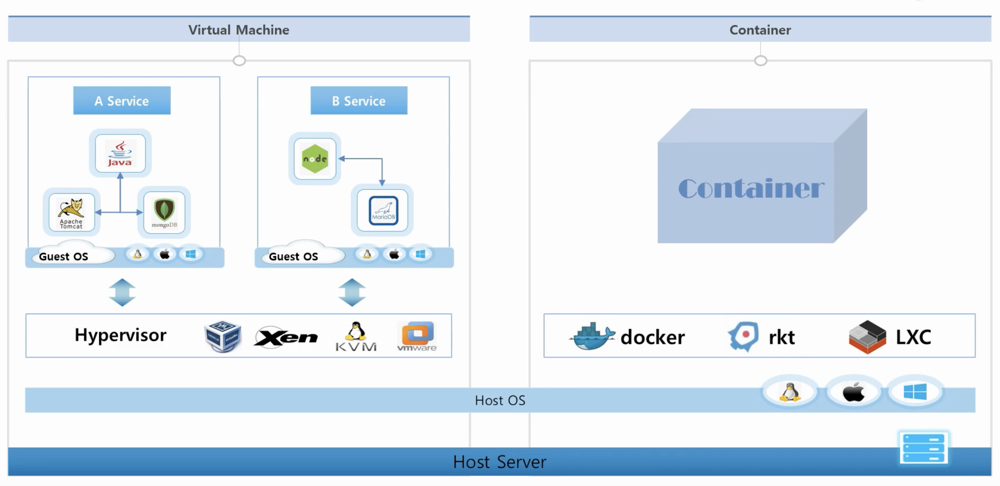

# 2. 기초 다지기

### 쿠버네티스는 왜 필요한 것일까?

- 만약에 각 서버에 다양한 서비스를 제공한다면 어떻게 될 것인가?
  - 서비스_1 : 이 서비스를 돌리기 위한 서버 여러개 필요
  - 서비스_2 : 이 서비스를 돌리기 위한 서버 여러개 필요
  - 서비스_3 : 이 서비스를 돌리기 위한 서버 여러개 필요
  - 결론 : 만약 어느 한 서비스의 사용량이 적더라도 수 많은 서버가 필요하게 됩니다.
    - 또한 각 서비스별로 백업서버를 개별적으로 구축해서 서버가 터졌을 경우 백업서버를 사용합니다.
    - 또한 서비스의 업데이트가 이루어진다면 한 서버씩 내리면서 업데이트 후 다시 서버를 구동시키게 됩니다.
- 만약에 **쿠버네티스**의 가상화 기술을 사용한다면?
  - 하루동안 서비스 1~3의 평균 트래픽을 계산한 후 서비스_1을 통해 트래픽의 양에 따라서 **한정된 서버**에서 서비스의 자원양을 변경시켜줍니다.
  - 장애가 난 서버위에 있는 서비스들이 다른 서버로 자동으로 옮겨주는 **Auto Healing** 기능이 있기 때문에 여분의 서버 1개만으로도 해결할 수 있습니다.
  - **Deployment**라는 오브젝트를 통해서 업데이트 방식을 자동으로 처리되도록 지원하고 있습니다.
  - 또한 다양한 기능으로 **운영자동화**를 지원하고 있습니다.
  - 즉 서비스의 효율이 증가하게 되고 서버가 적어지며 **유지보수 비용**이 감소하게 됩니다.
    - 바로 운영의 규모가 커질수록 쿠버네티스의 효과가 극대화됩니다.

### VM vs Container

- Container
  - 만약 Linux의 버전 별로 기본적으로 설치되어 있는 라이브러리 버전들이 다르게 됩니다. 그래서 만약 다른 버전에서 개발한 서비스를 다른 버전에서 구동하게 된다면 버전차이에 따른 이슈가 발생합니다.
  - 이를 **Docker**를 통해 **Container**의 이미지를 만들고 활용하게 된다면 다른 버전의 Linux에서도 여러 버전의 Linux 서비스를 구동할 수 있게 됩니다.
  - 또 여러 Contaienr의 호스트 자원을 분리해서 사용할 수 있게 도와줍니다.
    - 리눅스의 고유 기술인 `namespace`(커널와 관련된 영역을 분리)와 `cgroups`(자원과 관련된 영역을 분리)을 활용해 격리를 합니다.
  - 즉 OS에서 제공하는 자원 격리 기술을 이용해서 **Container**라는 단위로 서비스를 분리할 수 있게 도와주며 이것을 활용하면 **Container 가상화**가 깔려있는 OS에서는 **개발환경의 걱정없이 배포가 가능**하게 됩니다.
  - **Container**는 한 OS를 공유하는 개념이고 VM은 각각의 OS를 띄워야 하는 구조이기 때문에 **Container**의 속도가 훨씬 빠를 수 밖에 없습니다.
  - 단점
    - VM은 만약 Window를 사용하고 있을때 새로운 Guest OS를 설치할 때 리눅스 OS를 설치해서 사용할 수 있습니다.
    - Container는 리눅스 OS에서 Window용 Container를 사용할 수 없습니다.
    - 보안적으로 VM은 Guest OS가 공격을 당해도 다른 Guest OS나 Host OS와 완벽히 분리되어 있어서 피해가 가지 않습니다.
    - 하지만 Container는 공격을 당해 OS의 영역에 접근하게 되면 다른 Container가 위험해질 수 있습니다. 
- 시스템 개발사상의 차이점
  - VM
    - 일반적으로 서비스를 만들 때 **한가지의 언어**를 사용해 여러 모듈들을 개발해서 하나의 서비스를 제공합니다.
    - 만약 하나의 모듈이 부하가 심하다면 하나의 VM을 더 생성해서 띄우게 됩니다.
    - 하지만 모두 한 패키지이기 때문에 원하지 않았던 모듈들도 함께 새로운 VM에 올라가게 됩니다.
  - Container
    - 하나의 서비스를 만들 때 모듈별로 쪼개서 각각의 **Container**에 담도록 권하고 있습니다. ( **마이크로서비스** )
    - 또 그 모듈에 맞는 최적화되 언어를 활용한다면 더 좋은 성능과 개발을 할 수 있게 됩니다.
    - 여기서 **쿠버네티스**는 여러 **Container**들 아니면 한개의 **Container**를 한 **Pod**에 담을 수 있게 됩니다.
    - **Pod** : 하나의 배포 단위를 의미합니다.
      - 내가 필요한 Pod만 확장할 수 있습니다. ( 쿠버네티스의 기능 )
    - 즉 시스템을 모듈별로 쪼개어서 개발을 진행할 때 아주 큰 효과를 발휘할 수 있습니다.

