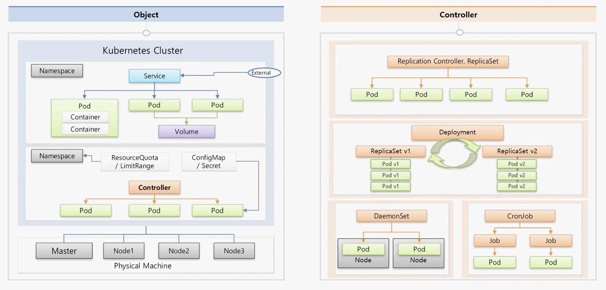

# 3. 처음 시도해보는 쿠버네티스 실습


### 먼저 리눅스에서 Node Server 만들기

```js
// hello.js 작성하기
vi hello.js

// 아래의 Node Server 코드를 넣어주세요!
var http = require('http');
var content = function(req, resp) {
 resp.end("Hello Kubernetes!" + "\n");
 resp.writeHead(200);
}
var w = http.createServer(content);
w.listen(8000);

// 서버실행 후 브라우저에서 접속 확인
node hello.js
```


### Docker File 만들기

- DockerFile

```
FROM node:slim // 도커 허브에서 어떤 이미지 사용할 것인지
EXPOSE 8000 // 어떤 Port를 개방할 것인지
COPY hello.js . // 어떤 파일들을 복사할 것인지
CMD node hello.j // Container가 구동될 때 이 명령어를 실행
```

- 리눅스에서 생성

```
// 위의 내용을 붙어넣고 저장하기!
vi Dockerfile
```

- 이미지 빌드하기

```
docker build -t test/hello .
// -t : 레파지토리/이미지명:버전, 버전을 생략하면 가장 최신버전 사용, 
// .의 의미는 현재 디렉토리를 뜻하며 현재 디랙토리의 DockerFile를 사용하겠다라는 의미
```

- 이미지 확인

```
docker images
```

- Container를 구동시켜보기

```
docker run -d -p 8100:8000 test/hello
// -d : 백그라운드 모드
// -p : 포트변경 ( Contianer로 구동할 때에는 8100으로 매칭해서 구동할 것이다라는 의미 )

// 실행중인 Container 확인
docker ps

// Container 들어가보기
docker exec -it Container_id /bin/bash

// Cotainer 나오기
exit
```


### 도커허브에 업로드

```/
// 도커 허브의 아이디와 비밀번호 입력
docker login

// 도버 허브에 업로드 ( 중요한 것은 레파지토리 이름(test)과 도커허브 ID가 동일해야 합니다.)
docker push test/hello
```


### 쿠버네티스 구동해보기

- 기존적으로 대시보드를 제공합니다.
- 하지만 실제 운영환경에서는 대시보드를 사용하지 말라고 권고하고 있습니다.
  - 보안적인 내용들이 보여지기 때문입니다.
- Pod => Container를 구동시킵니다.
  - 대시보드에서 상단 +생성을 클하여 생성합니다.

```
apiVersion: v1
kind: Pod
metadata:
  name: hello-pod
  labels:
    app: hello
spec:
  containers:
  - name: hello-container
    image: test/hello
    ports:
    - containerPort: 8000
```

- Service
  - Pod를 외부에서 접근할 수 있도록 도와줍니다.
  - 대시보드에서 상단 +생성을 클하여 생성합니다.
  - 외부 접속 IP: **192.168.0.30:8200**으로 접속해서 확인

```
apiVersion: v1
kind: Service
metadata:
  name: hello-svc
spec:
  // selector의
  app: hello의 key:value가 Pod의 label key:value와 매칭이 되면서 서비스와 Pod가 연결
  selector:  
    app: hello
  ports:
    - port: 8200  // 노출할 포트
      targetPort: 8000  // 컨테이너 포트는 8000입니다.
  externalIPs:
  - 192.168.0.30  // 접속 IP
```


## 쿠버네티스 살펴보기



- 쿠버네티스는 서버 1대를 **Master**로 사용하고 여러개의 Node( 여러대의 서버)와 연결 됩니다.
- 이것이 하나의 **쿠버네티스 Cluster**로 표현합니다.
- Master : 쿠버네티스의 전반적인 기능들을 컨트롤하는 역할
- Node : 자원을 제공하는 역할
  - Cluster의 전체 자원을 늘리고 싶다면 Node들을 계속 추가하면 됩니다.
- Cluster안의 **Namespace**가 쿠버네티스 오브젝트들을 독립된 공간으로 분리되게 만들어 주비다.
  - **Namespace**에는 쿠버네티스 최소 배포 단위인 **Pod**들이 존재합니다.
  - **Pod**들에게 외부로부터 연결이 가능하도록 IP를 할당해주는 **Service**가 존재합니다.
    - 서로다른 **Namespace**의 **Pod**들에게는 연결할 수 없습니다.
  - **Pod** 내부에는 여러개의 **Container**들이 존재합니다.
    - **Pod**의 문제가 생겨서 재생성이 되면 그 안의 데이터가 날라가게 됩니다.
    - 그래서 **Volume**을 만들어서 **Pod**에 연결하게 되면 데이터를 별도로 저정할 수 있게 해서 해결할 수 있습니다.
- **ResourceQuota**와 **LimitRange**를 이용해서 한 **Namespace**에서 사용할 수 있는 자원의 양을 한정시킬 수 있습니다.
  - Pod의 개수 제한
  - CPU 또는 메모리 제한
- **Pod** 생성시 **Container**안에 **환경변수 값**을 넣어준다거나 **파일을 Mounting** 할수가 있습니다.
  - **ConfigMap** / **Secret**을 통해 셋팅할 수 있습니다.
- **Controller**가 존재하여 **Pod**들을 관리해줍니다.
  - 정말 다양한 종류들이 존재하고 사용용도가 다릅니다.
  - **Replication Controller**, **ReplicaSet**
    - 가장 기본적인 Controller 입니다.
    - Pod가 죽으면 감지해서 다시 살려줍니다.
    - Pod의 개수를 늘렸다가 줄일 수 있습니다. (Scale in / out)
  - **Deployment**
    - 배포 후 Pod들을 새 버전으로 업그레이드 해줍니다.
    - 업그레이드를 하는 도중에 문제가 생기면 롤백을 도와줍니다.
  - **DaemonSet**
    - 한 노드의 Pod가 하나씩만 유지될 수 있도록 도와줍니다.
  - **CronJob**
    - Job은 어느 특정 작업만 하고 종료해야 할 때 Pod가 그렇게 동작을 하도록 도와줍니다.
    - 그런 Job들을 주기적으로 실행할 때 CronJob을 활용합니다.

