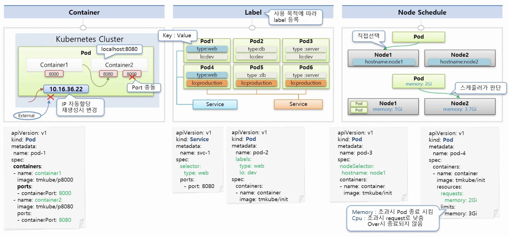

# 4. Object-Pod


### Container

- **Pod** 내부에는 하나의 독릭접인 서비스를 구동할 수 있는 **Container**가 존재합니다.
- 그 **Container**들은 서비스가 연결될 수 있도록 Port를 가지고 있습니다.
  - 한 **Pod**내에서 **Container**들끼리 Port가 중복될 수 없습니다.
- Pod가 생성될 때 고유의 IP주소가 할당이 됩니다.
  - 쿠버네티스 클러스터 내에서만 이 IP를 통해 해당 Pod에 접근할 수 있습니다.
    - 외부에서 접근 금지
  - 만약 Pod가 문제가 생기면 다시 삭제 후 재생성을 하게 되는데 그때 IP주소가 변경됩니다. (휘발성)


### Label

- **Pod** 뿐만 아니라 **모든** **쿠버네티스의 Object**에 적용할 수 있습니다.
  - **Pod**에서 가장 많이 사용됩니다.
- 목적에 따라 Object들을 분류하고 분류된 Object들만 따로 골라서 연결하기 위해 사용합니다.
- Label의 구성
  - **Key**와 **Value**가 한쌍입니다.
  - 한 **Pod**에 여러개의 **Label**을 달 수 있습니다.
  - dev 와 production으로 나눠서 Service에 연결해서 볼 수 있습니다.
  - 또한 Web, DB, Server 등 분류해서 연결해서 Servce를 통해 자신이 원하는 Pod들을 접속하여 볼 수 있게 됩니다.
- 추 후에 **Service**를 만들때 **selector**에 같은 **key: value**를 넣으면 해당 내용과 매칭되는 **Pod**와 연결됩니다.


### Node Schedule



- **Pod**는 여러 **Node**(Server)들중에서 한 **Node**(Server)에 올라가야 합니다.
  - 개발자가 직접 **Node**를 선택하는 방법
    - **Node**에 **Label**을 달고 **Pod**를 만들때 **Node**를 지정할 수 있습니다.
    - **Pod**를 만들때 **nodeSelector**에 **Node Label**과 매칭되는 key: value를 넣어주면 됩니다.
  - 쿠버네티가 자동으로 지정해주는 방법
    - 쿠버네티스의 스케줄러가 판단해서 지정해줄 수 있습니다.
    - Node에 남은 메모리를 참고해서 Pod를 할당합니다.
      - Pod를 생성할 때 요구되는 리소스의 사용양을 명시할 수 있습니다.
      - 그것을 보고 쿠버네티스가 알아서 Pod를 스케줄링 해줍니다.
      - **resources**에서 **requests**와 **limits**를 설정합니다.
        - requests : 요구 사항
        - limits : 최대 허용 값
      - 메모리의 경우 limit를 넘을 경우 Pod를 바로 종료합니다.
      - CPU의 경우 limit을 넘을 경우 request 수치 만큼 낮추고 종료하지 않습니다.
    - 이것을 설정하지 않으면 **Pod**안에 있는 서비스에서 부하가 생길 때 무한정 **Node**안에 있는 자원을 사용할려고 하다가 같은 **Node**에 있는 다른 **Pod**들은 자원이 없어서 같이 죽어버리게 됩니다.


## 실습해보기

### 1. Pod

### 1-1) Pod

- 임의의 Node Server 이미지 파일 2개를 도커 허브에 준비합니다.
- 대시보드를 통해 Pod를 생성합니다.

```yaml
apiVersion: v1
kind: Pod
metadata:
  name: pod-1
spec:
  containers:
  - name: container1
    image: test/p8000
    ports:
    - containerPort: 8000
  - name: container2
    image: test/p8080
    ports:
    - containerPort: 8080
```

- 왼쪽 대시보드 매뉴에서 **Pod**를 클릭한 후 내부에서 접근할 수 있는 IP 등 정보를 볼 수 있습니다.
  - 또한 상단의 **EXEC**를 통해 Pod 내부의 **Container**의 **shell**에 접근할 수 있습니다.
- **Pod** 내부에서 **Container**의 **Port**는 서로 중복될 수 없습니다!
- 또한 Pod가 재생성시 할당된 내부 IP가 변경됩니다.


### 1-2) ReplicationController

- **Controller**은 Pod를 생성해주고 Pod가 죽었을 경우 다시 생성시켜줍니다.
- 대시보드에서 상단 **+생성**을 통해 **Controller**를 생성합니다.
- 자동으로 Pod를 생성합니다.
  - **Pod**를 삭제해보면 바로 지워지지 않고 다시 새 **Pod**를 생성하면서 지우게 됩니다.
  - 이 때 IP가 변경된 것을 볼 수 있습니다.

```yaml
apiVersion: v1
kind: ReplicationController
metadata:
  name: replication-1
spec:
  replicas: 1
  selector:
    app: rc
  template:
    metadata:
      name: pod-1
      labels:
        app: rc
    spec:
      containers:
      - name: container
        image: kubetm/init
```


### 2. Label

- 아래 설정을 참고해서 6개의 Pod를 생성해봅시다.

### 2-1) Pod

```yaml
apiVersion: v1
kind: Pod
metadata:
  name: pod-1
  labels:
    type: web
    lo: dev
spec:
  containers:
  - name: container
    image: kubetm/init
```

### 2-2) Service

- 원하는 Pod들을 선택할 수 있습니다!
- 서비스 내부를 보게 되면 Label를 통해 연결된 pod들을 볼 수 있습니다.

```yaml
apiVersion: v1
kind: Service
metadata:
  name: svc-1
spec:
  selector:
    type: web
  ports:
  - port: 8080
```


### 3. Node Schedule

### 3-1) Pod

- 실제 **Node**의 내용을 보게 되면 기본적인  **Label**들이 만들어져 있습니다.
- 그중에서 `kubernetes.io/hostname: k8s-node1`를 선택한 것입니다.

```yaml
apiVersion: v1
kind: Pod
metadata:
  name: pod-3
spec:
  nodeSelector:
    kubernetes.io/hostname: k8s-node1
  containers:
  - name: container
    image: kubetm/init
```

### 3-2) Pod

- 쿠버네티스의 자동 할당 방법
- 새로운 Pod를 생성하면 할당 가능한 Node에 할당되게 됩니다.
  - 앞서 Node_1에는 이미 메모리가 부족하므로 Node_2에 할당될 것입니다.

```yaml
apiVersion: v1
kind: Pod
metadata:
  name: pod-4
spec:
  containers:
  - name: container
    image: kubetm/init
    resources:
      requests:
        memory: 2Gi
      limits:
        memory: 3Gi
```


### CPU와 Memory의 (Request, Limits)에 대한 더 자세하게 살펴보기

- **CPU**가 **limits** 수치까지 올라갔다고 해서 무조건 **Request** 수치까지 **core**를 낮추는 것이 아닙니다.
- **Node**의 전체 부하 상태가 **OverCommit된 상태일때 동작**합니다.
- **Node** 위의 **Pod**들이 **Node**의 자원을 모두 사용하고도 그 이상을 자원을 요구하게 되었을 때 **Limit 수치까지 CPU를 사용하고 있는 Pod들에 한해서** 그 수치를 **Reqeust**까지 떨어뜨리게 되며 **Memory의 경우에도 그러한 상태일때 Limit까지 올라간 Pod들에 한해 재기동** 시키게 됩니다. 


## Kubectl를 통한 실습

- Apply Vs Create
  - 둘다 자원을 생성할때 사용할 수 있지만, **Create**는 기존에 같은 이름의 Pod가 존재하면 생성이 안되고, **Apply**는 기존에 같은 이름의 Pod가 존재하면 업데이트됩니다.

### **Create**

```sh
# 파일이 있을 경우
kubectl create -f ./pod.yaml

# 내용과 함께 바로 작성
kubectl create -f - <<END
apiVersion: v1
kind: Pod
metadata:
  name: pod1
spec:
  containers:
  - name: container
    image: kubetm/init
END
```

### **Apply**

```sh
kubectl apply -f ./pod.yaml
```

### **Get**

```sh
# 기본 Pod 리스트 조회 (Namepsace 포함)
kubectl get pods -n defalut

# 좀더 많은 내용 출력
kubectl get pods -o wide

# Pod 이름 지정
kubectl get pod pod1

# Json 형태로 출력
kubectl get pod pod1 -o json
```

### **Describe**

```sh
# 상세 출력
kubectl describe pod pod1
```

### **Delete**

```sh
# 파일이 있을 경우 생성한 방법 그대로 삭제
kubectl delete -f ./pod.yaml

# 내용과 함께 바로 작성한 경우 생성한 방법 그대로 삭제
kubectl delete -f - <<END
apiVersion: v1
kind: Pod
metadata:
  name: pod1
spec:
  containers:
  - name: container
    image: kubetm/init
END

# Pod 이름 지정
kubectl delete pod pod1
```

### **Exec**

```sh
# Pod이름이 pod1인 Container로 들어가기 (나올땐 exit)
kubectl exec pod1 -it /bin/bash

# Container가 두개 이상 있을때 Container이름이 con1인 Container로 들어가기 
kubectl exec pod1 -c con1 -it /bin/bash
```


