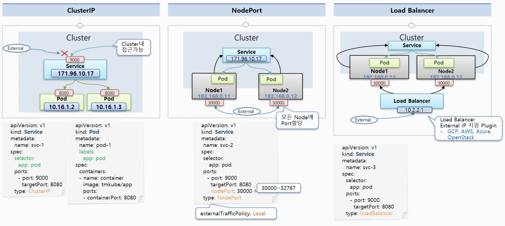

# 5. Object-Service

- 서비스는 자신의 **Cluster IP**를 가지고 있습니다.
- 그리고 이 서비스를 Pod에 연결시켜놓으면 서비스 IP를 통해 Pod에 접근할 수 있습니다.
  - 근데 Pod도 IP가 존재하는데 왜 꼭 서비스를 통해 접근해야 할까?
  - Pod는 쿠버네티스에서 시스템 장애 및 성능 장애에 의해서 언제든지 죽을 수 있고 다시 재생성 되도록 설계가 되어있는 오브젝트입니다.
  - 또한 Pod의 IP는 재생성시 변경됨으로 신뢰성이 떨어집니다.
  - 서비스는 사용자가 직접 지우지 않는 한 삭제되거나 재생성 되지 않습니다.
  - 그래서 서비스 **IP로 접근하게 된다면 항상 연결되어 있는 Pod에 접근**할 수 있게 됩니다.



- 서비스의 종류 ( type )
  - **ClusterIP** ( 기본값, 생략시 적용 )
    - 이 IP는 쿠버네티스 클러스터 내부에서만 접근이 가능한 IP입니다.
    - **외부에서 접근할 수 없습니다.**
    - 또 여러개의 Pod와 연결할 수 있습니다.
      - 이 때에 서비스가 트래픽을 분산해서 Pod로 전달해줍니다.
    - 이 IP에 접근할 수 있는 대상은 클러스터 내부에 접근할 수 있는 운영자와 같은 인가된 사용자만 가능합니다.
      - 주된 작업은 내부 대쉬보드를 관리하거나 Pod의 서비스 상태 디버 작업을 할 때 사용
  - **NodePort**
    - 서비스에 동일하게 클러스터 IP가 할당됩니다.
    - 쿠버네티스 클러스터에 연결되어 있는 모든 Node에 똑같은 Port가 할당되어 외부로 부터 어느 Node 간에 그 IP + Port로 접속하게 되면 이 서비스에 연결이 됩니다.
    - 서비스는 기본역할인 자신에게 연결된 Pod에게 트래픽을 전달해줍니다.
    - Pod가 존재하는 Node에만 포트가 할당되는 것이 아니라 모든 Node에 포트가 할당됩니다.
      - Node Port의 범위 : 30000~32767 값만 사용 가능합니다.
    - 서비스 입장에서는 **어떤 노드로 온 트래픽의 상관없이** 자신에게 연결된 Pod들에게 분산해서 트래픽을 전달합니다.
      - 만약 `externalTrafficPolicy: Local `을 추가하면 특정 노드포트의 IP로 접근하는트래픽은 서비스가 해당 노드위에 올려져 있는 Pod에게만 트래픽을 전달하게 됩니다.
    - 대부분 호스트 IP는 보안적으로 내부망에서만 접근을 할 수 있게 네트워크를 구성하기 때문에 **NodePort**는 클러스터 밖에는 있지만 내부망 안에서 접근을 해야할 때 사용합니다.
    - **데모나 일시적인 임시 연결용으로 사용**합니다.
  - **Load Balancer**
    - 기본적으로 NodePort의 성격을 그대로 가지고 있습니다.
    - 추가적으로 **Load Balancer**라는 것이 생겨서 각각의 **Node에 트래픽을 분산**시켜주는 역할을 합니다.
    - 문제점 : Load Balancer 접근을 하기 위한 외부 접속 IP 주소는 개별적으로 쿠버네티스에서 생기지 않습니다. 즉 별도로 **외부접속 IP를 할당해주는 플러그인이 설치**가 되어있어야 합니다.
    - 보통 AWS, 구글 클라우드 등 쿠버네티스 플랫폼을 활용하면 자체적으로 플러그인이 설치되어 있어서 아라서 외부에서 접속하는 IP를 만들어 줍니다.
    - **실제 외부 시스템 노출용** 입니다. 그래야 내부 IP가 노출되지 않고 외부 IP를 통해 서비스를 노출시킬 수 있습니다.


## 실습해보기

### 1. ClusterIP

### 1-1) Pod

- Pod를 생성합니다.

```yaml
apiVersion: v1
kind: Pod
metadata:
  name: pod-1
  labels:
     app: pod
spec:
  nodeSelector:
    kubernetes.io/hostname: k8s-node1
  containers:
  - name: container
    image: kubetm/app
    ports:
    - containerPort: 8080
```

### 1-2) Service

- **type**을 넣지 않으면 자동으  **ClusterIP**로 설정됩니다.
- 서비스의 9000 Port로 접근히 Pod의 8080 Port로 접근하게 됩니다.

```yaml
apiVersion: v1
kind: Service
metadata:
  name: svc-1
spec:
  selector:
    app: pod
  ports:
  - port: 9000
    targetPort: 8080
    
// 쿠버네티스 마스터 서버에서 접속이 가능합니다.    
curl 10.104.103.107:9000/hostname
```


### 2. NodePort

### 2-1) Service

- 만약 `externalTrafficPolicy` 사용시 해당 Node에 Pod가 없을 경우우 접근할 수 없습니다. ( 무한정 기다린다. )

```yaml
apiVersion: v1
kind: Service
metadata:
  name: svc-2
spec:
  selector:
    app: pod
  ports:
  - port: 9000
    targetPort: 8080
    nodePort: 30000
  type: NodePort
  externalTrafficPolicy: Local
```


### 3. Load Balancer

### 3-1) Service

- 외부에서 접근할 수 있도록 외부 IP를 할당해주는 플러그인이 필요합니다.
- EXTERNAL-IP => 무한 pending

```yaml
apiVersion: v1
kind: Service
metadata:
  name: svc-3
spec:
  selector:
    app: pod
  ports:
  - port: 9000
    targetPort: 8080
  type: LoadBalancer

// Test
kubectl get service svc-3
```


### 4. Sample Yaml

### 4-1) **Service**

```yaml
apiVersion: v1
kind: Service
metadata:
  name: svc-3
spec:
  selector:             # Pod의 Label과 매칭
    app: pod
  ports:
  - port: 9000          # Service 자체 Port
    targetPort: 8080    # Pod의 Container Port
  type: ClusterIP, NodePort, LoadBalancer  # 생략시 ClusterIP
  externalTrafficPolicy: Local, Cluster    # 트래픽 분배 역할
```


### 5. Kubectl

### 5-1) **Get**

- Defalut 이름의 Namespace에서 test-1 이름의 Service 조회합니다.

```sh
kubectl get service test-1 -n defalut
```

