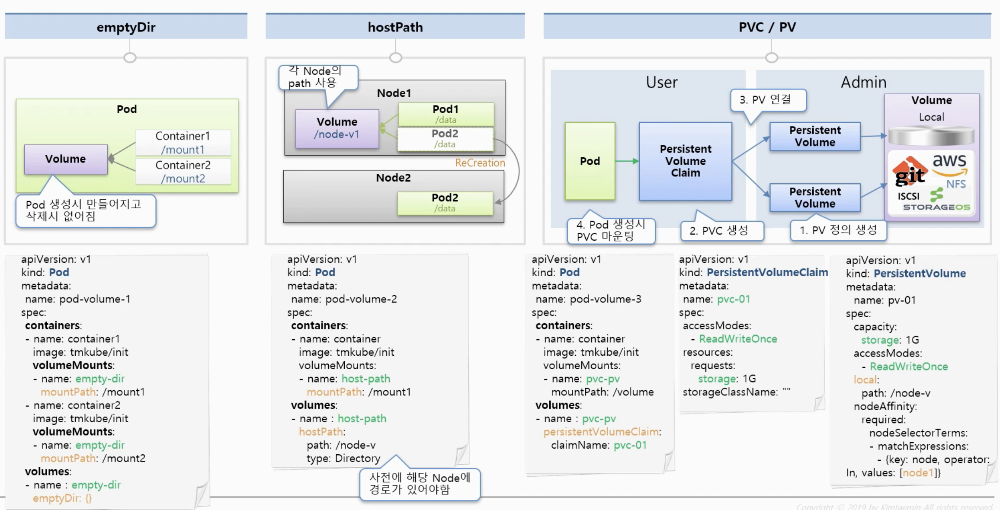

# 6. Object-Volume



- **emptyDir**
  - 컨테이너들 끼리 데이터를 공유하기 위해 볼륨을 사용하는 것입니다.
    - `volumeMounts`를 활용해 `name`과 `mountPath`를 넣어줍니다.
    - `mountPath` : 해당 컨테이너가 이 Path로 볼륨을 연결하겠다는 의미
      -  두개의 컨테이너의 `mountPath`가 다르더라도 `name`은 같기 때문에 **하나의 볼륨을 사용**하는 것입니다.
    - `volumes`를 활용해 `name`과 `emptyDir: {}`를 넣어줍니다.
  - 최초의 볼륨이 생성될 때에는 항상 비어있습니다.
  - Pod 안에 생성되고 Pod가 문제가 발생해서 재생성되면 **Data가 다 날라가게 됩니다.**
  - 그래서 이 Volume에 사용하는 Date는 일시적으로 사용하는 Data만 넣어야 합니다.
- **hostPath**
  - Pod들의 올라가져 있는 **Node의 Path를 볼륨으로써 사용**하는 것입니다.
  - **Pod들이 죽어도 이 Node의 Data는 유지**됩니다.
    - 단 Pod 입장에서는 문제가 있습니다.
    - 만약 Pod가 죽어서 재생성 될 때 다시 그 해당 Node에 재생성 된다는 보장은 없습니다.
    - Pod가 재생성되는 순간에 스케줄러가 자원상황을 고려해 다른 Node에 생성할 수 있습니다.
    - 그래서 그 Pode는 Node의 볼륨을 마운팅할 수 없게 됩니다.
    - 해결법 : Node가 추가될 때마다 똑같은 경로를 가진 볼륨을 만들어서 직접 Node들간의 볼륨들을 마운트해줍니다. 하지만 이부분은 쿠버네티스가 해주지않고 운영자가 리눅스 시스템의 마운트 기술을 활용해 연결해야 합니다.
    - 어려운 부분은 아니지만 사람의 개입이 들어가면서 실수를 유발할 수 있기 때문에 비추천합니다.
  - 각각의 Node에는 기본적으로 각 Node 자신을 위해 사용되는 여러 설장파일들이 존재합니다. Pod 자신이 할당되어 있는 Host의 데이터를 읽거나 사용할 때 이것을 사용합니다.
  - 주의사항 : **HostPath**는 **Pod**가 만들어지기전에 사전에 만들어져있어야 **Pod**가 생성이 될 때 에러가 발생하지 않습니다.
- **PVC / PV**
  - **Pod**의 **영속성있는 볼륨을 제공**해줍니다.
  - 실제 볼륨들의 형태는 다양합니다.
    - Local 볼륨, AWS, Git, NFC 등 외부의 원격으로 사용되는 볼륨들도 존재합니다.
    - 이런것들을 바탕으로 **PV(Persistent Volume)**을 정의하고 연결합니다.
  - **Pod**는 바로 **PV**에 연결하지 않고 **PVC(Persistent Volumen Claim)**를 통해서 **PV**와 연결이 됩니다.
    - **PVC**를 두는 이유
      - 쿠버네티스는 볼륨사용에 있어서 **User** 영역과 **Admin** 영역을 나눴습니다.
      - **Admin** : 쿠버네티스를 담당하는 쿠버네티스 운영자를 의미합니다.
      - **User** : Pod에 서비스를 만들고 배포를 관리하는 서비스 담당자를 의미합니다.
      - 즉 **Persistent Volume**를 정의하기 위해서는 각각의 서비스마다 가르게 작성해야 합니다. ( 복잡 )
      - 그래서 전문적으로 관리하는 운영자가 PV를 만들고 User는 이것을 사용하기 위해 PVC를 만듭니다.
      - User가 생성하는 PVC ( 그림 예제 )
        - 읽기쓰기 모드가 가능하고 용량이 1G의 볼륨을 할당해줘! 라는 의미
        - `storageClassName: ""`를 마지막으로 넣으면 현재 만들어진 PV 들 중에서 선택이 됩니다.
          - **쿠머네티스가 PVC 내용에 맞는 적절한 볼륨에 연결**해줍니다.
          - 만약 `""`를 생략하게 되면 다른 동작으로 동작하게 됩니다.
      - 마지막으로 Pod를 만들때 PVC를 연결합니다.
  - PVC ( 그림 예시 )
    - 실습을 위해 Local 볼륨을 사용합니다.
    -  `values: [node1]`: 이 PV에 연결되는 Pod들은 node1이라고 라벨링이 되어 있는 Node위에만 무조건 만들어진다는 의미입니다.
    - 실제로 Local Type의 볼륨은 잘 사용하지 않습니다.
    - `spec`의 `capacity`와 `accessModes`의 내용을 보고 쿠버네티스가 PVC요청에 맞게 연결해줍니다.


## 실습하기

### 1. EmptyDir

### 1-1) Pod

```yaml
apiVersion: v1
kind: Pod
metadata:
  name: pod-volume-1
spec:
  containers:
  - name: container1
    image: kubetm/init
    volumeMounts:
    - name: empty-dir
      mountPath: /mount1
  - name: container2
    image: kubetm/init
    volumeMounts:
    - name: empty-dir
      mountPath: /mount2
  volumes:
  - name : empty-dir
    emptyDir: {}
```

- 확인해보기
  - **Pod를 삭제후 재생성시 볼륨은 없어지게 됩니다.**

```
// test => 컨테이너 1 접속
ls // 내부 파일 조회
mount | grep mount1  // mount가 된 폴더인지 확인
cd mount1
echo "file context" >> file.txt // mount 폴더 내부에 파일 생성

// test => 컨테이너 2 접속
ls
cd mount2
ls => 컨테이너 1에서 만들었던 file.txt가 그대로 존재합니다.
```


### 2. HostPath

- HostPath Type
  - DirectoryOrCreate : 실제 경로가 없다면 생성합니다.
  - Directory : 실제 경로가 있어야됩니다.
  - FileOrCreate : 실제 경로에 파일이 없다면 생성합니다.
  - File : 실제 파일이 었어야합니다.

### 2-1) Pod

- `type: DirectoryOrCreate` : 만약 `path: /node-v`가 존재하지 않을 경우 생성하겠다라는 의미
  - 사전에 Node에 Path를 생성할 필요가 없습니다.
- 이 두개의 Pod는 같은 Node_1에 만들어지게 될 것이고 `/node-v`의 디렉토리를 공유하게 될 것입니다.
- 만약 `nodeSelector`를 제거해서 같은 **Node**에 생성하지 않으면 스케줄러가 자동으로 자원 상황을 바탕으로 다른 **Node**에서 **Pod**를 생성하기 때문에 공유할 수 없게 됩니다.

```yaml
apiVersion: v1
kind: Pod
metadata:
  name: pod-volume-2
spec:
  nodeSelector:
    kubernetes.io/hostname: k8s-node1
  containers:
  - name: container
    image: kubetm/init
    volumeMounts:
    - name: host-path
      mountPath: /mount1
  volumes:
  - name : host-path
    hostPath:
      path: /node-v
      type: DirectoryOrCreate
```

```yaml
apiVersion: v1
kind: Pod
metadata:
  name: pod-volume-3
spec:
  nodeSelector:
    kubernetes.io/hostname: k8s-node1
  containers:
  - name: container
    image: kubetm/init
    volumeMounts:
    - name: host-path
      mountPath: /mount1
  volumes:
  - name : host-path
    hostPath:
      path: /node-v
      type: DirectoryOrCreate
```


### 3. PVC / PV

### 3-1) PersistentVolume

- 이 **PV**에 연결된 **Pod**들은 **node1**에 만들어 집니다.
- 3개의 **PV**를 생성합니다.

```yaml
apiVersion: v1
kind: PersistentVolume
metadata:
  name: pv-01
spec:
  capacity:
    storage: 1G
  accessModes:
  - ReadWriteOnce
  local:
    path: /node-v
  nodeAffinity:
    required:
      nodeSelectorTerms:
      - matchExpressions:
        - {key: kubernetes.io/hostname, operator: In, values: [k8s-node1]}
```

- `ReadOnlyMany` 사용

```yaml
apiVersion: v1
kind: PersistentVolume
metadata:
  name: pv-02
spec:
  capacity:
    storage: 1G
  accessModes:
  - ReadOnlyMany
  local:
    path: /node-v
  nodeAffinity:
    required:
      nodeSelectorTerms:
      - matchExpressions:
        - {key: kubernetes.io/hostname, operator: In, values: [k8s-node1]}
```

- 용량  2G 사용

```yaml
apiVersion: v1
kind: PersistentVolume
metadata:
  name: pv-01
spec:
  capacity:
    storage: 2G
  accessModes:
  - ReadWriteOnce
  local:
    path: /node-v
  nodeAffinity:
    required:
      nodeSelectorTerms:
      - matchExpressions:
        - {key: kubernetes.io/hostname, operator: In, values: [k8s-node1]}
```


### 3-2) PersistentVolumeClaim

- `ReadWriteOnce`와 `1G`로 설정했기 때문에 **pv-01**와 연결이 됩니다.
- 한번 **PV**가 바인딩되면 해당 **PV**는 다른 **Claim**에서 사용할 수 없게 됩니다.

```yaml
apiVersion: v1
kind: PersistentVolumeClaim
metadata:
  name: pvc-01
spec:
  accessModes:
  - ReadWriteOnce
  resources:
    requests:
      storage: 1G
  storageClassName: ""
```

- `ReadOnlyMany`설정에 의해서 **pv-02**와 연결이 됩니다.

```
apiVersion: v1
kind: PersistentVolumeClaim
metadata:
  name: pvc-02
spec:
  accessModes:
  - ReadOnlyMany
  resources:
    requests:
      storage: 1G
  storageClassName: ""
```

- 만약 현재 남아있는 **PV**는 용량이 2G인데 3G로 **PVC**를 만든다면?
  - 적합한 볼륨이 없기 때문에 연결이 이루어지지 않고 pending 상태입니다.
- 만약 현재 남아있는 **PV**는 용량이 2G인데 1G로 **PVC**를 만든다면?
  - pv-03으로 PV가 연결됩니다.
  - 즉 **자신보다 높은 스토리지의 볼륨에는 할당**을 해줍니다!

```
apiVersion: v1
kind: PersistentVolumeClaim
metadata:
  name: pvc-03
spec:
  accessModes:
  - ReadWriteOnce
  resources:
    requests:
      storage: 3G or 1G
  storageClassName: ""
```


### 3-3) Pod

- Pod 내부에서 `ls`로 조회시 mount3 디렉토리가 존재하고 내부의 데이터를 사용할 수 있습니다.

```yaml
apiVersion: v1
kind: Pod
metadata:
  name: pod-volume-3
spec:
  containers:
  - name: container
    image: kubetm/init
    volumeMounts:
    - name: pvc-pv
      mountPath: /mount3
  volumes:
  - name : pvc-pv
    persistentVolumeClaim:
      claimName: pvc-01
```


### 4. PV-PVC를 Label과 Selector를 이용해 연결하는 방법

### 4-1) PersistentVolume

```yaml
apiVersion: v1
kind: PersistentVolume
metadata:
  name: pv-03
  labels:
    pv: pv-03
spec:
  capacity:
    storage: 2G
  accessModes:
  - ReadWriteOnce
  local:
    path: /node-v
  nodeAffinity:
    required:
      nodeSelectorTerms:
      - matchExpressions:
        - {key: kubernetes.io/hostname, operator: In, values: [k8s-node1]}
```

### 4-2) PersistentVolumeClaim

```yaml
apiVersion: v1
kind: PersistentVolumeClaim
metadata:
  name: pvc-04
spec:
  accessModes:
  - ReadWriteOnce
  resources:
    requests:
      storage: 1G
  storageClassName: ""
  selector:
    matchLabels:
      pv: pv-03
```

