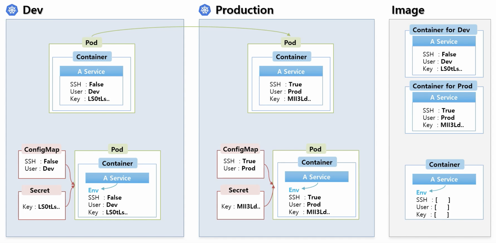
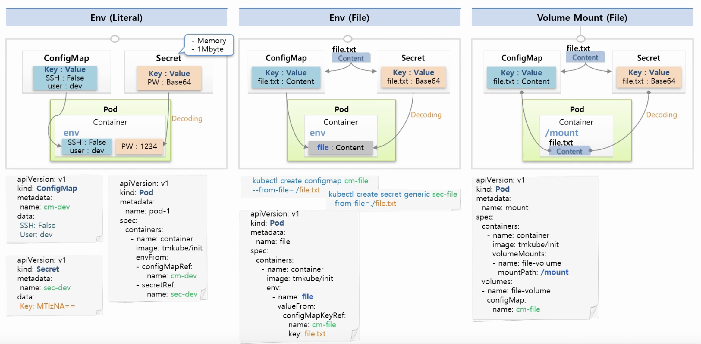

# 7. Object-ConfigMap, Secret



### 사용하는 목적

- 일반적으로 배포할 때에는 **개발환경(Dev)**와 상용환경(Pod)이 존재합니다.
- 각 환경마다 필요한 설정파일이 달라지게 됩니다.
- 그래서 이것을 해결하기 위해 각각 Image를 관리해야 합니다. ( 비효율 )
- 그래서 환경에 따라 변하는 값들은 외부에서 결정을 할 수 있게하는데 그것을 도와주는 것이 **ConfigMap**과 **Secret**입니다.

- 일반적인 상수들을 모아서 **ConfigMap**을 만들고 보안적인 관리가 필요한 값을 모아 **Secret**을 만듭니다.
- **Pod** 생성시 이 두개의 **Object**를 연결하게 되면 **Container**안에 환경변수들이 들어가게 됩니다.
  - 즉 **Image** 한개만으로 **개발환경**과 **상용환경** 모두 사용할 수 있습니다.


### 사용하는 방법



- **ConfigMap**과 **Secret**를 생성할 때 데이터로 상수를 넣을 수 있고 파일을 넣을 수 있습니다.
  - 또한 파일을 넣을 때 Volume Mount를 해서도 사용할 수 있습니다.
- **Env ( Literal )**
  - **Key**와 **Value**로 구성되어 있습니다.
  - Pod를 생성할 때 **ConfigMap**을 가져와서 컨테이너 안의 환경변수에 셋팅할 수 있습니다.
  - **Secret**도 동일하나 **Value**를 넣을 때 **base64**로 인코딩을 해서 넣어야 합니다.
    - Pod로 주입이 될 때에는 디코딩이 되서 원래의 값이 보이게 됩니다.
    - 일반적인 Object 값들은 쿠버네티스 DB에 저장이 되는데 **Sectet**의 보안적인 요소는 **메모리에 저장**이 됩니다.
    - 그래서 Secret을 너무 많이 만들게 되면 메모리를 사용하기 때문에 시스템의 영향을 끼칠 수 있습니다.
  - **ConfigMap**의 경우 **Key**와 **Value**를 무한으로 넣을 수 있지만 **Sectet**은 **1MB** 까지만 넣을 수 있습니다.
  - 문서 작성 방법은 예시 그림을 보시면 쉽게 이해할 수 있습니다.
- **Env ( File )**
  - 파일 전체를 **ConfigMap**에 담을 수 있습니다.
  - **Key : 파일이름**, **Value : 파일 안의 내용** => ConfigMap 완성
    - Key가 파일이름으로 되어 있으면 어색한 부분이 있으니 Key를 새로 정의를 해서 넣을 수 있습니다.
  - 문서 작성 방법은 예시 그림을 보시면 쉽게 이해할 수 있습니다.
  - **환경변수 방식**은 한번 주입을 하게 되면 끝이기 때문에 **ConfigMap**의 데이터가 변해도 **Pod**의 환경변수 값은 영향이 없습니다.
    - **Pod**가 죽어서 재생성이 되야 변경된 값을 다시 받아올 수 있습니다.

```
// configmap 생성 : cm-file의 이름으로 만들 것이고 file.txt를 넣을 것이다.
kubectl create configmap cm-file --from-file=./file.txt

// secret 생성 : 이 명령은 file.txt 안의 내용이 base64로 알아서 인코딩 해주기 때문에 미리 인코딩 금지
kubectl create secret generic sec-file --from-file=./file.txt
```

- **Volume Mount ( File )**
  - file.txt를 **ConfigMap**에 담는 과정은 위와 동일하지만 Pod를 생성할 때 컨테이너 안에 `mountPath`를 정의하고 이 Path안에 파일을 마운팅 할 수 있습니다.
  - 문서 작성 방법은 예시 그림을 보시면 쉽게 이해할 수 있습니다.
  - 이 방식은 원본 파일과 연결시켰기 때문에 내용이 변하더라도 **Pod**에 마운팅된 데이터도 같이 변하게 됩니다.


## 실습하기

### 1. Env (Literal)

### 1-1) ConfigMap

- **value**는 모두 **Stirng** 값입니다.
  - **Boolean** 값도 **String** 처리를 해야합니다.

```yaml
apiVersion: v1
kind: ConfigMap
metadata:
  name: cm-dev
data:
  SSH: 'false'
  User: dev
```

### 1-2) Secret

- 꼭 모든 **Value**는 **Base64 인코딩**을 해야합니다.

```yaml
apiVersion: v1
kind: Secret
metadata:
  name: sec-dev
data:
  Key: MTIzNA==
```

### 1-3) Pod

```yaml
apiVersion: v1
kind: Pod
metadata:
  name: pod-1
spec:
  containers:
  - name: container
    image: kubetm/init
    envFrom:
    - configMapRef:
        name: cm-dev
    - secretRef:
        name: sec-dev
```


### 2. Env (File)

### 2-1) Configmap

```sh
echo "Content" >> file-c.txt
kubectl create configmap cm-file --from-file=./file-c.txt
```

### 2-2) Secret

- 알아서 **Base64 인코딩**이 이루어집니다.

```sh
echo "Content" >> file-s.txt
kubectl create secret generic sec-file --from-file=./file-s.txt
```

### 2-3) Pod

```yaml
apiVersion: v1
kind: Pod
metadata:
  name: pod-file
spec:
  containers:
  - name: container
    image: kubetm/init
    env:
    - name: file-c
      valueFrom:
        configMapKeyRef:
          name: cm-file
          key: file-c.txt
    - name: file-s
      valueFrom:
        secretKeyRef:
          name: sec-file
          key: file-s.txt
```


### 3. Volume Mount (File)

### 3-1) Pod

```yaml
apiVersion: v1
kind: Pod
metadata:
  name: pod-mount
spec:
  containers:
  - name: container
    image: kubetm/init
    volumeMounts:
    - name: file-volume
      mountPath: /mount
  volumes:
  - name: file-volume
    configMap:
      name: cm-file
```


### 4. Kubectl

### 4-1) **ConfigMap**

```sh
# file-c.txt 라는 파일로 cm-file라는 이름의 ConfigMap 생성
kubectl create configmap cm-file --from-file=./file-c.txt
# key1:value1 라는 상수로 cm-file라는 이름의 ConfigMap 생성
kubectl create configmap cm-file --from-literal=key1=value1
# 여러 key:value로 cm-file라는 이름의 ConfigMap 생성 
kubectl create configmap cm-file --from-literal=key1=value1 --from-literal=key2=value2
```

### 4-2) **Secret Generic**

```sh
# file-s.txt 라는 파일로 sec-file라는 이름의 Secret 생성
kubectl create secret generic sec-file --from-file=./file-s.txt
# key1:value1 라는 상수로 sec-file라는 이름의 Secret 생성
kubectl create secret generic sec-file --from-literal=key1=value1
```

