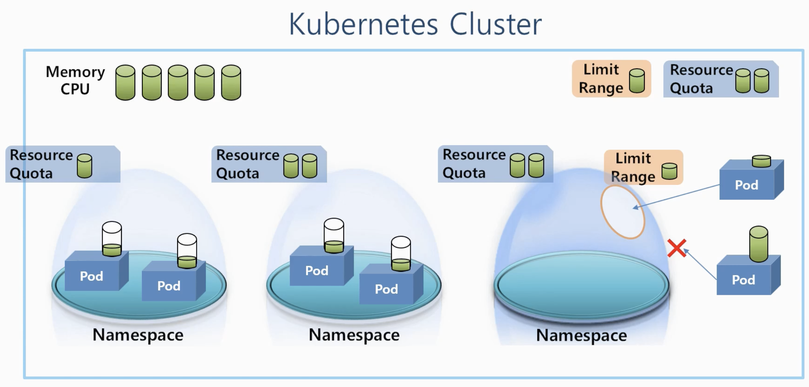
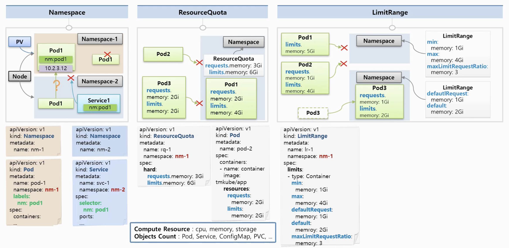

- 이러한 Object들을 왜 사용해야 할까?
- **쿠버네티스 클러스터**에는 전체 사용할 수 있는 자원(메모리, CPU 등)이 존재합니다.
- 클러스터 내부에는 여러 **Namespace**를 만들 수 있습니다.
- **Namespace**안에는 여러 **Pod**들을 만들 수 있습니다.
  - 각 **Pod**는 필요한 자원을 **클러스터 자원을 공유**해서 사용합니다.
  - 만약 한 **Namespace**안에 있는 **Pod**가 클러스터 안에 있는 남은 자원을 모두 사용해버리면 다른 **Pod** 입장에서 더이상 쓸 자원이 없어서 자원이 필요할 때 문제가 발생합니다.
- 위와 같은 문제를 해결하기 위해 **ResourceQuato**가 존재합니다.
  - **Namespace**마다 **ResourceQuato**를 달게 되면 **Namespace**마다 **최대 한계를 설정**할 수 있습니다.
  - 그래서 Pod 자원이 위에서 설정한 한계를 넘을 수 없습니다.
  - 즉 Pod입장에서 자원이 부족해서 문제가 생길 수는 있지만 다른 Namespace안에 있는 Pod들에게는 영향을 끼치지 않습니다.
- 하지만 또 같은 **Namespace**안에 한 **Pod**가 자원사용량을 크게 해버리면 다른 **Pod**는 이 **Namespace**안으로 들어올 수 없게 됩니다.
  - 이러지 못하도록 관리하기 위해 **LimitRange**를 사용해서 **Namespace**에 들어오는 **Pod**의 크기를 제한할 수 있습니다.
- 또한 **ResourceQuato**와 **LimitRange** 이 2개의 **Object**는 **Namespace**도 달수 있지만 클러스터에도 달아서 **전체 자원의 제한**을 걸 수 있습니다.




### Namespace

- **Namespace**는 실제 서버와 같은 물리적인 개념이 아니고 **논리적인 개념**입니다.
  - 즉 쿠버네티서에서 다루는 **Object**들을 **그룹핑**하는 것이 목적입니다.

- 한 **Namespace**내부에는 같은 타입의 **Object**들은 이름이 중복될 수 없는 특징을 가지고 있습니다.
  - 이름 또한 Key역할을 할 수 있다는 의미입니다.
- 다른 **Namespace**의 자원과 분리되어서 관리가 이루어집니다.
  - **Service**에서 다른 **Namespace**에 있는 **Pod**와 연결할 수 없습니다.
  - 또 지금까지 배웠던 대부분의 자원들은 그 자원안에서 만든 **Namespace**에서만 사용할 수 있습니다.
  - 하지만 **Node** 또는 **PV** 같은 경우 모든 **Namespace**에서 공용으로 사용될 수 있는 **Object**도 존재합니다.
- **Namespace**를 제거하게 되면 그 안에 있는 자원까지 모두 제거 됩니다.
- **Namespace**안에 있는 **pod**에서 다른 **Namespace**안이 **pod**의 i**p**로 접근은 가능합니다. 다른 Object를 통해 **연결 제한**을 할 수 있습니다.
- yaml 작성법
  - **Namespace**를 만들 때에는 이름 이외에 특별하게 작성하는 값이 없습니다.
  - **Pod** 또는 **Service**를 만들 때 내가 속할 **Namespace**를 지정할 수 있게 됩니다.
    - 만약 **Service**와 **Pod**가 속하는 **Namespace**가 위 그림처럼 다를 경우 **selector**와 **label**의 값이 일치하더라도 연결되지 않습니다.


### ResourceQuota

- **Namespace**의 자원의 한계를 설정하는 Object입니다.
  - `requests.memory: 3Gi` : **Namespace**에 들어갈 **Pod**들의 전체 request 자원들을 최대 3기가로 설정
  - `limits.memory: 6Gi` : 메모리의 limit는 6기가로 설정
- **Namespace**의 내부에 **ResurceQuota**가 정의된 곳에 **Pod**를 생성할 때 그 **Pod**는 **스펙을 명시**해야합니다.
  - 스펙이 없이면 해당 Namespace에 만들어지지 않습니다.
- 또한 **request가 초과**할 경우 같은 **Namespace**에 **Pod**를 만들 수 없습니다.
- yaml 작성법
  - **ResurceQuota**를 생성할 때 할당할 **Namespace**를 설정합니다.
  - **hard**라는 속성 안에 제한할 종류와 자원과 한계치가 들어가게 됩니다.
    - 제한할 수 있는 것 : cpu, memory, storage, Object 수
      - Object Count : Pod, Service, ConfigMap, PVC  등 가능합니다.
- 참고 : https://kubernetes.io/docs/concepts/policy/resource-quotas


### LimitRange

- 각각의 **Pod**마다 **Namespace**에 들어올 수 있는지 자원을 체크해줍니다.
  - `min: memory: 1Gi` : **Pod**에서 설정되는 메모리 limit 값이 1G를 넘어야 한다는 의미
  - `max: memory: 4Gi` : **Pod**에서 설정되는 메모리 limit 값이 4G를 초과할수 없다는 의미
  - `maxLimitRequestRatio: memory: 3` : **request** 값과 **limit**값의 비율이 최대 3배를 넘으면 안된다는 의미
    - 그림 예시
      - Pod1은 설정된 **limit**값이 `memory:5Gi` => **max**가 4Gi 이기 때문에 들어올 수 없습니다.
      - Pod2는 **limits/requests** => 4/1 => 4배의 비율 => 비율이 3으로 설정되어있어서 들어올 수 없습니다.
- `defalutRequest`와 `default`가 존재합니다.
  - 설정을 하게 되면 pod3에 아무런 스팩설정을 하지 않더라 여기에 명시된 값이 자동으로 할당됩니다.
- yaml 작성법
  - **LimitRange**를 만들 때 할당할 **Namespace**를 명시합니다.
  - **limits**라는 속성에 **type**을 **container**별로 제한을 할때 그림처럼 옵션을 넣을 수 있었습니다.
    - 만약 **type**에 **pod**단위나 **PVC**단위일 경우 각각의 타입마다 지원되는 옵션이 다르기 때문에 별도로 확인해야 합니다.
- 참고 : https://kubernetes.io/docs/tasks/administer-cluster/limit-storage-consumption


## 실습하기

### 1. Namespace

### 1-1) Namespace

```yaml
apiVersion: v1
kind: Namespace
metadata:
  name: nm-1
```

### 1-2) Pod

- 앞에서 생성한 **Namespace**를 지정해서 만듭니다.

```yaml
apiVersion: v1
kind: Pod
metadata:
  name: pod-1
  namespace: nm-1
  labels:
    app: pod
spec:
  containers:
  - name: container
    image: kubetm/app
    ports:
    - containerPort: 8080
```

### 1-3) Service

- 위의 **Pod**와 연결됩니다.
- 앞에서 생성한 **Namespace**를 지정하지 않으면 Pod와 연결할 수 없습니다.

```yaml
apiVersion: v1
kind: Service
metadata:
  name: svc-1
  namespace: nm-1
spec:
  selector:
    app: pod
  ports:
  - port: 9000
    targetPort: 8080
```


### 1-1’) Namespace

```yaml
apiVersion: v1
kind: Namespace
metadata:
  name: nm-2
```

### 1-2’) Pod

```yaml
apiVersion: v1
kind: Pod
metadata:
  name: pod-1
  namespace: nm-2
  labels:
    app: pod
spec:
  containers:
  - name: container
    image: kubetm/init
    ports:
    - containerPort: 8080
```


pod ip :

```sh
curl 10.16.36.115:8080/hostname
```

service ip :

```sh
curl 10.96.92.97:9000/hostname
```


### Namespace Exception

### E-1) Service

- **Node Port**도 **Namespace**를 나눌 수 없습니다.

```yaml
apiVersion: v1
kind: Service
metadata:
  name: svc-2
spec:
  ports:
  - port: 9000
    targetPort: 8080
    nodePort: 30000
  type: NodePort
```

### E-2) Pod

- 다른 Namespace에서 같은 Pod를 생성하면 Namespace가 다르더라도 hello.txt 파일을 볼 수 있습니다.

```yaml
apiVersion: v1
kind: Pod
metadata:
 name: pod-2
spec:
  nodeSelector:
    kubernetes.io/hostname: k8s-node1
  containers:
  - name: container
    image: kubetm/init
    volumeMounts:
    - name: host-path
      mountPath: /mount1
  volumes:
  - name : host-path
    hostPath:
      path: /node-v
      type: DirectoryOrCreate
echo "hello" >> hello.txt
```


### 2. ResourceQuota

### 2-1) Namespace

```yaml
apiVersion: v1
kind: Namespace
metadata:
  name: nm-3
```

### 2-2) ResourceQuota

```yaml
apiVersion: v1
kind: ResourceQuota
metadata:
  name: rq-1
  namespace: nm-3
spec:
  hard:
    requests.memory: 1Gi
    limits.memory: 1Gi
```

ResourceQuota Check Command

- 잘 만들어졌는지 확인하기

```sh
kubectl describe resourcequotas --namespace=nm-3
```

### 2-3) Pod

- ResourceQuota가 적용된 Namespace에 resources부분을 빼고 Pod를 생성하려면 반드시 명시하라고 에러가 발생합니다.

```yaml
apiVersion: v1
kind: Pod
metadata:
  name: pod-2
spec:
  containers:
  - name: container
    image: kubetm/app
```

### 2-4) Pod

- resources를 명시했으니 이제는 잘 생성 됩니다.
  - 한번더 Pod를 생성해서 만약 0.8GI로 넣어버리면 1G가 넘기 때문에 에러가 발생합니다.
- Pod의 개수도 제한할 수 있습니다.
- 만약 먼저 Pod를 생성하고 ResourceQuota를 적용하면 기존에 있던 Pod들를 적용이 되지 않습니다.
  - 그래서 먼저 ResourceQuota를 만들려면 해당 Namespace에 Pod가 존재하면 안됩니다.

```yaml
apiVersion: v1
kind: Pod
metadata:
  name: pod-3
spec:
  containers:
  - name: container
    image: kubetm/app
    resources:
      requests:
        memory: 0.5Gi
      limits:
        memory: 0.5Gi
```


### 3. LimitRange

### 3-1) Namespace

```yaml
apiVersion: v1
kind: Namespace
metadata:
  name: nm-5
```

### 3-2) LimitRange

```yaml
apiVersion: v1
kind: LimitRange
metadata:
  name: lr-1
spec:
  limits:
  - type: Container
    min:
      memory: 0.1Gi
    max:
      memory: 0.4Gi
    maxLimitRequestRatio:
      memory: 3
    defaultRequest: // Pod에 리소스를 명시하지 않았을 때 기본값
      memory: 0.1Gi
    default:
      memory: 0.2Gi
```

LimitRange Check Command

- 잘 만들어졌는지 확인해보기

```sh
kubectl describe limitranges --namespace=nm-5
```

### 3-3) Pod

- 에러 발생 : 현재 max가 0.4G인데 0.5G를 요청했고 비율이 3인데 지금 비율은 5이기 때문입니다.

```yaml
apiVersion: v1
kind: Pod
metadata:
  name: pod-1
spec:
  containers:
  - name: container
    image: kubetm/app
    resources:
      requests:
        memory: 0.1Gi  => 0.2Gi (성공)
      limits:
        memory: 0.5Gi  => 0.4Gi (성공)
```


### LimitRange Exception

### E-1) Namespace

```yaml
apiVersion: v1
kind: Namespace
metadata:
  name: nm-6
```

### E-2) LimitRange

```yaml
apiVersion: v1
kind: LimitRange
metadata:
  name: lr-5
spec:
  limits:
  - type: Container
    min:
      memory: 0.1Gi
    max:
      memory: 0.5Gi
    maxLimitRequestRatio:
      memory: 1
    defaultRequest:
      memory: 0.5Gi
    default:
      memory: 0.5Gi
```

### E-3) LimitRange

```yaml
apiVersion: v1
kind: LimitRange
metadata:
  name: lr-3
spec:
  limits:
  - type: Container
    min:
      memory: 0.1Gi
    max:
      memory: 0.3Gi
    maxLimitRequestRatio:
      memory: 1
    defaultRequest:
      memory: 0.3Gi
    default:
      memory: 0.3Gi
```

### E-4) Pod

- 위의 두개 **LimitRange**를 생성합니다.
- Pod 생성시 에러가 발생합니다.
- 한 **Namespace**에 **LimitRange**가 여러개 일 경우 예상치 못한 에러가 발생할 수 있습니다.
  - 정상적으로 작동할 수도 있다.
  - defaultRequest는 1번에 적용, max는 2번에 적용되버리는 등 에러 발생!

```yaml
apiVersion: v1
kind: Pod
metadata:
  name: pod-1
spec:
  containers:
  - name: container
    image: kubetm/app
```


### LimitRange에 대한 강의 내용 보충

```yaml
ResourceQuota는 Namespace 뿐만 아니라 Cㄴluster 전체에 부여할 수 있는 권한이지만,
LimitRange의 경우 Namespace내에서만 사용 가능합니다.
```


### 4. Kubectl

### 4-1) **Describe**

```sh
# nm-3의 Namespace에 있는 ResourceQuota들의 상세 조회
kubectl describe resourcequotas --namespace=nm-3
# nm-5의 Namespace에 있는 LimitRange들의 상세 조회
kubectl describe limitranges --namespace=nm-5
```