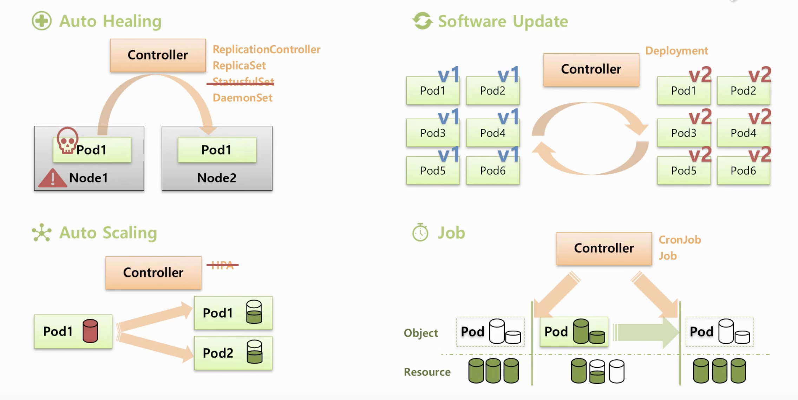

# 9. Controller



- 쿠버네티스는 여러개의 **Controller**가 존재합니다.
- 서비스를 관리하고 운영하는데에 큰 도움을 줍니다.
- **Auto Healing**
  - Node위에 Pod가 있는데 Pod 또는 Node가 다운될 때 컨트롤러는 이것을 즉각적으로 인지하고 Pod를 다른 Node에 새로 만들어줍니다.
- **Auto Scaling**
  - Pod의 리소스가 리미트상태가 되었을 때 컨트롤러는 이 상태를 파악하고 Pod를 하나 더 생성해서 부하를 분산시켜주고 Pod가 죽지 않도록 해줍니다.
- **Software Update**
  - 여러 Pod들에 대한 버전을 업그레이드 해야할 경우 컨트롤러를 통해 한번에 쉽게 할 수 있습니다.
  - 업그레이드 도중에 문제가 생기더라도 롤백 기능도 지원합니다.
- **Job**
  - 일시적인 작업을 해야할 경우 컨트롤러가 필요한 순간에만 Pod를 생성하고 작업 수행을 한 뒤 Pod를 삭제합니다.
  - 효율적인 자원 활용이 가능해집니다.


### Replication Controller와 ReplicaSet

- **Replication Controller**은 **Deprecated Object** 입니다.
- 이것을 대체로 사용하는 것이 **ReplicaSet**입니다.
- **Template**와 **Replicas**는 위 **두 Object**의 공통된 기능입니다.
- **Selector**는 **ReplicaSet**의 확장된 기능입니다.
- **Replication Controller**은 **ReplicaSet**으로 **업데이트** 할 수 있습니다.

### 기능

- **Template**
  - **컨트롤러**와 Pod는 서비스와 Pod처럼 **라벨**과 **selector와 연결**이 됩니다.
  - 컨트롤러를 만들때 Template로 pod의 내용을 넣게 되는 **Pod가 다운되면 template에 넣은 Pod의 정보를 바탕으로 새로 만들어주게 됩니다.**
  - 이러한 특성을 활용해서 App에 대한 업그레이드를 할 수 있습니다.
    - Template안에 있는 Pod를 업그레으를 진행 => 연결된 Pod는 다운 => 컨트롤러는 Template를 가지고 Pod를 재생성하려고 하기 때문에 새로 업그레이드 된 Pod를 가지고 업그레이드를 진행하게 됩니다. ( 수동 업그레이드 )
- **Replicas**
  - **Replicas의 수 만큼 Pod의 개수가 관리**되며 **Pod가 삭제가 되면 그 수만큼 Pod를 재생성** 해줍니다.
    - 개수 증가 : Scale Out
    - 개수 감소 : Scale in
  - Template 기능와 Replicas 기능을 통해 Pod와 컨트롤러를 한번에 만들 수 있습니다.
  - Replicas와 Template만 담아서 컨트롤러를 생성하면 Replicas에 현재 생성된 Pod가 없기 때문에 자동으로 Template의 정보를 가지고 Pod를 생성합니다.
    - 실제로 컨트롤러를 활용할 때 이렇게 활용합니다.
- **Selector**
  - **ReplicaSet**에만 있는 기능입니다.
  - **Replication** 컨트롤러의 **Selector**는 키와 라벨이 같은 Pod들과 연결해줍니다.
  - **ReplicaSet**는 **Selector**에 두가지 추가적인 속성이 있습니다.
    - 키와 벨류가 같아야 연결을 해주는 기존 기능이 존재합니다. ( **matchLabels** )
    - 키와 벨류를 좀 더 디테일하게 컨트롤 할 수 있습니다. ( **matchExpressions** )
      - **Operator:Exists**라고 넣게 되면 **value**는 다르지만 라벨의 같은 **key**를 모두 선택하게 됩니다.
      - 옵션 종류는 종 4가지
        - Exists : 내가 Key를 정하고 그에 맞는 Key를 가지고 있는 Pod들과 연결
        - DoesNotExits : 내가 Key를 정한 값이 들어가지 않는 Pod들을 선택 및 연결
        - In : `Key: A`와 `Values: 2,3`를 지정하면 Key가 A인 Pod들 중에 Values가 2,3인 Pod들만 선택
        - NotIn : `Key: A`와 `Values: 2,3`를 지정하면 Key가 A인 Pod들 중에 Values가 2,3이 아닌 Pod들만 선택


# 실습하기

### 1. Template, Replicas

### 1-1) Pod

- `terminationGracePeriodSeconds` : 기본적으로 Pod를 삭제하게 되면 30초 후에 삭제가 되는데 이 옵션을 추가하면 삭제 시간을 설정할 수 있습니다. ( **0이면 Pod 바로 삭제** )

```yaml
apiVersion: v1
kind: Pod
metadata:
  name: pod1
  labels:
    type: web
spec:
  containers:
  - name: container
    image: kubetm/app:v1
  terminationGracePeriodSeconds: 0
```


### 1-2) ReplicaSet

- 만약 replicas의 수가 1=2로 증가되면 template에 정의된 Pod name을 무시하고 새로운 이름으로 생성합니다.
  - 같은 Namespace안에 같은 이름을 가진 Pod가 존재할 수 없는 이유와 같습니다.
- Pod를 하나 삭제해도 다시 새로운 Pod를 생성합니다.
- 수동으로 Pod의 버전을 업그레이드 하고 싶으면 Tempalte의 Image의 버전을 변경하고 기존의 Pod를 모두 삭제합니다.
- 컨트롤러를 삭제하면 연결된 Pod들도 삭제 됩니다.
  - 삭제되게 안하려면 따로 옵션을 설정해야 합니다. ( 아래 명령어 참고 )

```yaml
apiVersion: apps/v1
kind: ReplicaSet
metadata:
  name: replica1
spec:
  replicas: 1
  selector:
    matchLabels:
      type: web
  template:
    metadata:
      name: pod1
      labels:
        type: web
    spec:
      containers:
      - name: container
        image: kubetm/app:v1
      terminationGracePeriodSeconds: 0
```


### 2. Updating Controller

- ReplicationController -> ReplicaSet

### ReplicationController

```yaml
apiVersion: v1
kind: ReplicationController
metadata:
  name: replication1
spec:
  replicas: 2
  selector:
    cascade: "false"
  template:
    metadata:
      labels:
        cascade: "false"
    spec:
      containers:
      - name: container
        image: kubetm/app:v1
```

### Kubectl

- Pod는 그대로 유지한채 컨트롤러를 지우는 명령어 입니다.

```sh
kubectl delete replicationcontrollers replication1 --cascade=false
```

### ReplicaSet

```yaml
apiVersion: apps/v1
kind: ReplicaSet
metadata:
  name: replica2
spec:
  replicas: 2
  selector:
    matchLabels:
      cascade: "false"
  template:
    metadata:
      labels:
        cascade: "false"
    spec:
      containers:
      - name: container
        image: kubetm/app:v1
```


### 3. Selector

### 3-1) ReplicaSet

- 일반적으로 `matchLabels`를 자주 사용합니다.
  - **selector의 내용이 template label의 내용에 포함**되어야 합니다. (matchExpressions 동일)
- `matchExpressions` 내가 원하는 Object들만 세밀하기 선택할 때 사용합니다.
  - 추후 **Node 스케줄링** 할때 자주 사용하게 됩니다.

```yaml
apiVersion: apps/v1
kind: ReplicaSet
metadata:
  name: replica1
spec:
  replicas: 1
  selector:
    matchLabels:
      type: web
      ver: v1
    matchExpressions:
    - {key: type, operator: In, values: [web]}
    - {key: ver, operator: Exists}
  template:
    metadata:
      labels:
        type: web
        ver: v1
        location: dev
    spec:
      containers:
      - name: container
        image: kubetm/app:v1
      terminationGracePeriodSeconds: 0
```


### Pod

```yaml
apiVersion: v1
kind: Pod
metadata:
  name: pod-node-affinity1
spec:
  affinity:
    nodeAffinity:
      requiredDuringSchedulingIngnoredDuringExecution:
        nodeSelectorTerms:
        - matchExpressions:
  	       - {key: AZ-01, operator: Exists}
  containers:
  - name: container
    image: kubetm/init
```

